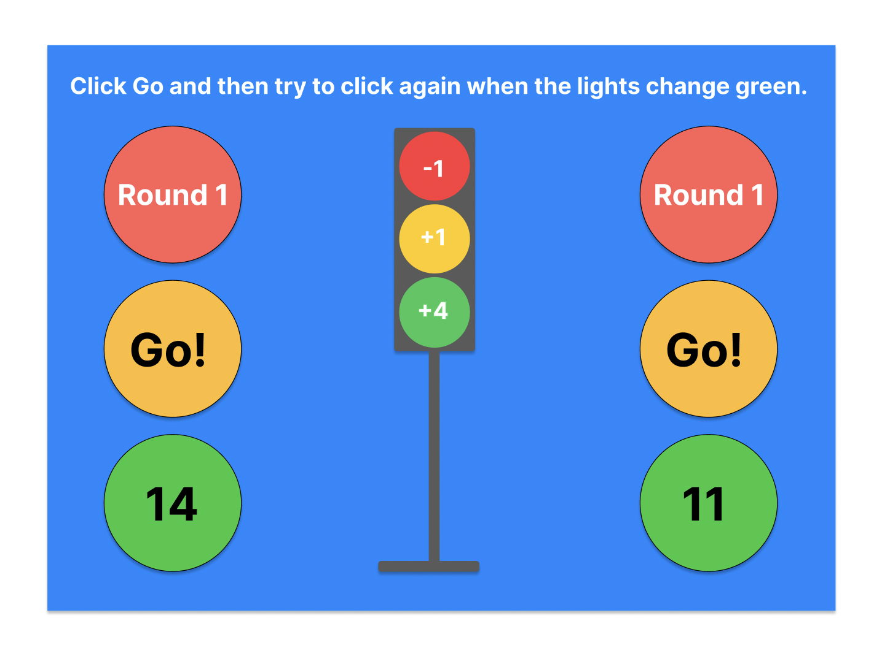

# The Plan

These notes are here for future reference and to help me keep track of my intentions.

I set out to practise after a few months off work. Someone made a super basic suggestion to get me started: just make a shape using HTML and CSS. I made a circle and then added two more and gave the three traffic light colours. My friend suggested I use my Javascript skills to make one of the circles change colour every second. My commitment to accessibility concerns triggered me to add a button to stop the colours changing and that's where the fun began. It was easy to turn it into a game and to record the stopped on colour. I decided to make it more fun and add a points system: green +4, yellow +1, red -1 and to add rounds. Once the player meets a score threshold the speed of flash increases.

This was all fun to do and then I felt the need to call that a prototype and to begin again in React in order to work in a test-driven and component-driven way and to make the design of the UI more appealing.

## Creating a React App in early 2026

With the deprecation of our old friend 'create react app' in early 2025, research and chatGPT led me to create my Lights app using Node.js, Yarn, Vite, React, and typescript.

## Test-driven Development
I decided to try Vitest for the first time. I've previously used Jest but the lightweight and purportedly speedy Vitest with hot reloading, re-running only changed code and affected tests, looked worth exploring.
This video was very helpful to get Vitest configured for Typescript - https://www.youtube.com/watch?v=U24H2mLwhgc

## Component-driven design
I propose creating the following:-

- text: for consistency of design and accessibility across components
- circle: for lights, round indicator, and scoring
- rectangle: for parts of the traffic light
- button

## Proposed upgrades to the prototype

1. create UI design 
2. consider changing background colour at round changes
3. more rounds including ones with irregular colour change intervals that may score more points
3. 2-player version

## Design

## Branching Strategy
Even though I'm doing this single handedly I want to maintain good source control so features will be developed on separate branches and merged in when they have full coverage.

## Accessibility
The prototype game would be unplayable for anyone with a red-green colour deficiency. There needs to be an investigation into offering choice(s) so that anyone could enjoy the game. This could be by having different colour schemes or adding shading to help distinguish the different colours.
from WCAG... "Use information in addition to color, such as shape or text, to convey meaning."
My first thought would be that the shading would be switched on by default and that players could opt to turn it off.

After a few days working on this, I now see that I want to make a game that follows the principles of inclusive design. I want to design the game so that by default it will work for the widest range of people. Anyone would then have options to customise the game without labelling or segregating users.

To make an inclusive game, having thought about players with little or no vision, I considered screen readers, initially with aria-labels, for the light colours. Having done a little research, I'm going to try using audio tones instead:-
red light - low pitch
orange light - medium pitch
green light - high pitch
Once the player has stopped on a light, the screen reader could read out the colour showing and the total score. When a round threshold is reached there will either need to be an announcement while the player is stopped or (a vibration would be good on a hand-held device) another tone. It might be worth disabling the Go button until the round announcement has happened.